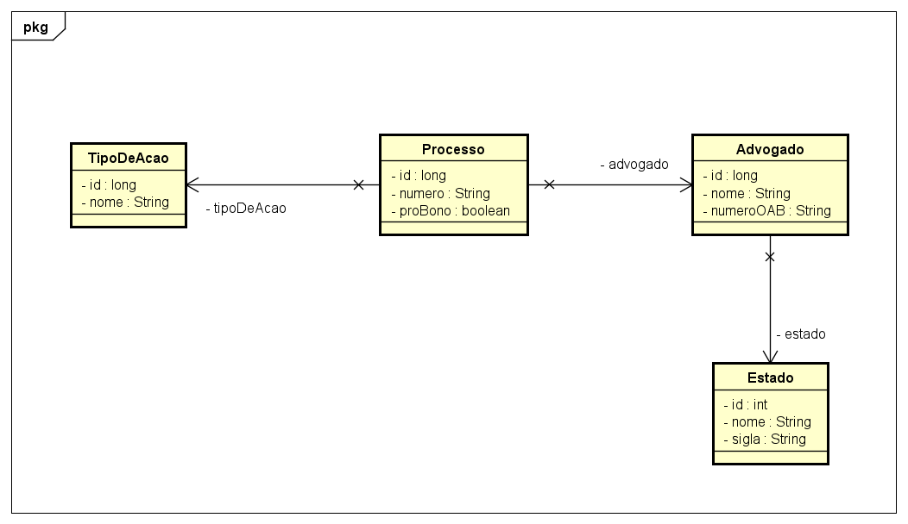

# Controle de Processos Judiciais do Benezinho 🤓👍🏾

SIMULADO - Enterprise Application Development aplicada em 23/08/2023.


|                | **Enterprise Application Development** |
|------------------------------------------|----------------------------------------|
| **ALUNO:**                               | **TURMA:** 2TDSPT  - 2TDSPR            |
| **PROFESSOR:** Benefrancis do Nascimento | 23/08/2023                             |
| **SIMULADO**                      | ****                                   |

# Sumário


[Estudo de caso ](#_Estudo_de_caso)

[O que deverá ser feito? ](#_O_que_devera_ser_feito)

[Diagrama de Classes ](#_Diagrama_de_Classes)

[Como Entregar ](#_Entrega)

[Correção da Prova ](#_Correcao)

<a id="_Estudo_de_caso"></a>

# Estudo de caso

Com o objetivo de aprimorar as atividades de trabalho, idealizamos o desenvolvimento de um Sistema de Gestão de Processos Judiciais.

Criaremos, nesta aula, um Produto Mínimo Viável (PMV) de um sistema para controle de processos judiciais. 


Nossa equipe de analistas desenvolveu o Diagrama de Classes abaixo, e a sua missão aqui é realizar o Mapeamento Objeto Relacional das classes de Entidade. Usaremos a JPA e o Hibernate como ferramentas de Mapeamento Objeto Relacional.

Na sprint atual, você foi incumbido de fazer:

1. O Mapeamento Objeto Relacional das primeiras classes envolvidas neste projeto de software;

2. A criação automatizada das tabelas no banco de dados Oracle;

3. A persistência de todos os dados, e;

4. A criação de dois métodos capazes de realizar consultas aos Processos persistidos previamente:

5. Consultar todos os processos findAll;

6. Consultar processo pela chave primária findById.


<a id="_O_que_devera_ser_feito"></a>

# O que deverá ser feito?


**Você deverá:**

**Fazer o fork do projeto do github.**:

https://github.com/Benefrancis/advocacia-benezinho

Caso o github esteja indisponível, você deverá pegar o projeto no diretório compartilhado.

Alterar o arquivo contido em  **documentacao/equipe.txt** para incluir os RMs e nomes e turma da dupla que fará esta atividade.

**OBS:** Será com base nos nomes contido neste aquivo que eu irei atribuir a nota.

1. **(0,5 Ponto)** acessar o arquivo persistence.xml e alterar as configurações da **persistence-unit** para que seja possível conectar-se ao banco de dados Oracle da FIAP com o seu usuário e senha (manter o seu usuário e senha ativo é sua responsabilidade). Não utilize o usuário e senha de outro aluno. Caso tenha problema para autenticar, comunique o professor.


2. **(3 Pontos)** adicionar corretamente as anotações JPA na classe **Processo**.

    Lembre-se que:


    1. Existe relacionamento **Muitos para Um** entre **Processo** e **Advogado** no atributo advogado.
    2. Existe relacionamento **Muitos para Um** entre **Processo** e **TipoDeAcao** no atributo tipoDeAcao. 
    3. Existe a necessidade de ser impedir que o **número** do processo seja nulo e se repita. Crie uma **Unique Constraint para o atributo** com nome inteligível.


3. **(1,5 Ponto)** adicionar corretamente as anotações JPA na classe **Advogado**.
    

   Lembre-se que:

    1. Existe relacionamento **Muitos para Um** entre **Advogado** e **Estado** a no atributo estado.
    2. Existe a necessidade de ser impedir que o **numeroOAB** seja nulo e se repita. Crie uma **Unique Constraint para o atributo** com nome inteligível.


4. **(1 Ponto)** adicionar corretamente as anotações JPA na classe **Estado**.

    Lembre-se que:


    1. Existe a necessidade de ser impedir que o **nome** e a **sigla** do estado se repita. Crie uma **Unique Constraint para cada um desses atributos** com nome inteligível.


5. **(1 Ponto)** adicionar corretamente as anotações JPA na classe **TipoDeAcao**.
   
    Lembre-se que:


    1. Existe a necessidade de ser impedir que o **nome** do Tipo de Ação seja nulo e se repita. Crie uma **Unique Constraint para cada um desses atributos** com nome inteligível.

6. **(1 Ponto)** Persistir dodas as entidades no SGBD.;

7. **(1 Ponto)** criar um método capaz de consultar um **Processo** pelo seu identificador na correspondente tabela no banco de dados e exibir os dados no prompt;

8. **(1 Ponto)** criar um método capaz de consultar todos os processos na correspondente tabela no banco de dados e exibir no prompt;


<a id="_Diagrama_de_Classes"></a>

# Diagrama de Classes




<a id="_Entrega"></a>

# Como Entregar

**A entrega deverá ser feita pelo Teams**, porém não se esqueça de fazer o **commit** e **push** do projeto no github.


<a id="_Correcao"></a>

# Correção da Prova

Nos próximos dias, a correção da prova será disponibilizada no github do professor (branch correcao):

Para acessar digite no prompt:

```shell
git clone https://github.com/Benefrancis/advocacia-benezinho && cd benezinho-advocacia && git checkout correcao
```


A avaliação é em dupla.


Boa avaliação.
